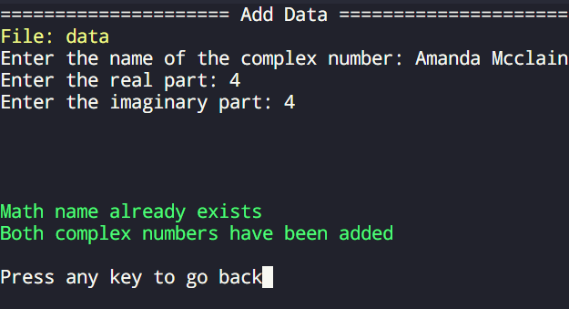
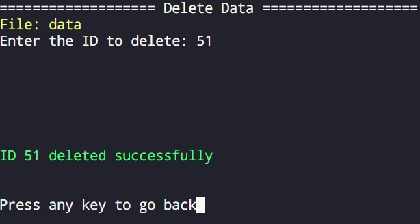
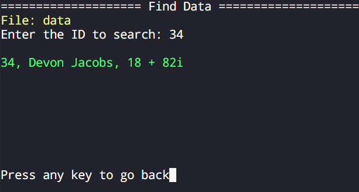
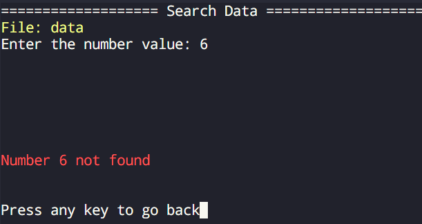

# **Data Manager OOP**  


## **📌 Overview**  

**Data Manager OOP** is a **C++ application** that demonstrates key **Object-Oriented Programming (OOP)** principles. It provides an efficient way to **manage, search, and manipulate structured data** through a terminal-based user interface. The application supports **CRUD operations (Create, Read, Update, Delete)** with data stored in **CSV files** for persistence.


## **🚀 Features**  

✔ **Data Management** – Create, delete, search, and update data entries efficiently.  
✔ **Terminal-Based UI** – A structured interface guiding users through operations.  
✔ **Persistent Storage** – Automatically manages **CSV files** for data storage.  
✔ **Random Data Generation** – Uses the **Faker** library to create sample datasets.  

## **📂 Project Structure**  

```
Data-Manager-OOP/
│── main.cpp         # Main application code
│── classes.hpp      # Class definitions and implementations
│── ui.hpp           # User interface functions
│── state.hpp        # Enum definitions for program states
│
├── generator/       # Folder for data generation scripts
│   └── create_data.py  # Python script for generating fake data
│
└── database/        # Folder where CSV files are stored
```


## **🛠 Setup Instructions**  

### **1️⃣ Clone the Repository**  

```bash
git clone git@github.com:Cris24dc/Data-Manager-OOP.git
cd Data-Manager-OOP
```

### **2️⃣ Install Dependencies**  

📌 **Install the Faker library (for data generation):**  
```bash
pip install faker
```

📌 **Install ncurses (for terminal UI):**  
```bash
sudo apt install libncurses5-dev libncursesw5-dev
```


## **▶ Running the Application**  

### **📌 1. Generate Fake Data (Optional)**  
```bash
python3 ./generator/create_data.py
```
The script will prompt you to enter a **CSV filename** and the **number of entries** to generate.

### **📌 2. Build & Run the Program**  
```bash
g++ main.cpp -o main.o -lncurses && ./main.o
```

Upon launch, the program will ask for a **filename**:  
- If the file exists in the `database/` folder, it will be opened.  
- If not, a **new file** will be created with the specified name.  


## **🖥️ User Interface & Functionality**  

### **📌 1. Add Data**  
Allows users to **insert new data entries** into the file.  


### **📌 2. Delete Data**  
Enables removal of data entries by **ID** or **name**.  


### **📌 3. Find Data**  
Lets users **search for specific data entries** using **ID** or **name**.  


### **📌 4. Search Data**  
Provides functionality to **filter and locate specific values** within the dataset.  

